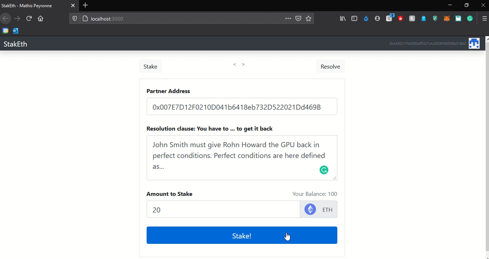

# StakEth: ether deposit smart contract.

I've built a simple platform where you can easily stake/deposit Ether. 

The smart contract stores all the contract's information and if the staker has followed through according to the resolution clause(i.e. the partner says so) the staker gets his money back. Otherwise, the partner gets the money as a compensation.

It is built using: 
- For the Ethereum smart contract: Solidity.
- For the UI: NodeJS & ReactJS
- For the tests: I've written a couple of tests with ChaiJS. 

Disclaimer: this is just a small project for fun and learning purposes. More effort should be allocated to thinking about having a reputation system with an ERC-20 token etc... 

[Here is a video Demo](https://onedrive.live.com/embed?cid=57D2E023F588C7E3&resid=57D2E023F588C7E3%2114185&authkey=ABsZ4sefvj8bH58)

## Some screenshots

<br>

<br>

<br>


##Run it on your machine

Install all the node packages:
```Bash
npm install
```
Launch [Ganache](https://www.trufflesuite.com/ganache), exposing the port 7545 normally.
<br>Then migrate the smart contracts to the blockchain:
```Bash
truffle migrate --reset
```
Launch the webserver(Hosted locally on port 3000):
```Bash
npm run start
```
Finally, Connect your MetaMask to the ganache blockchain :)